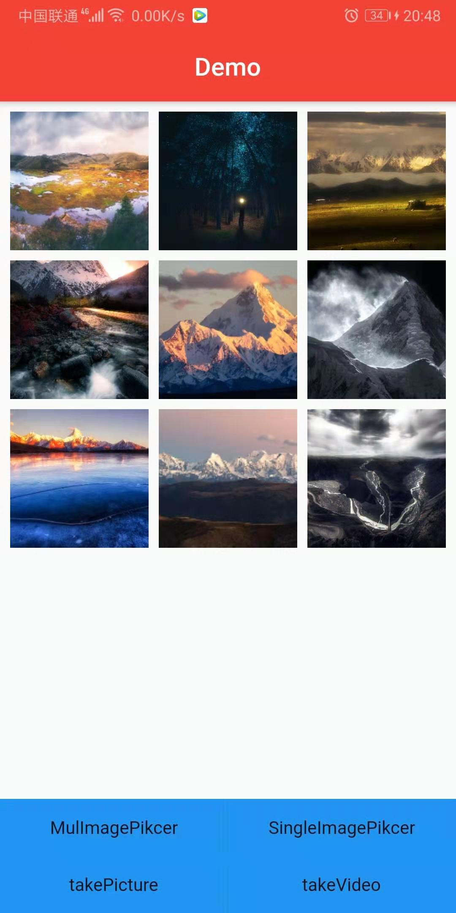
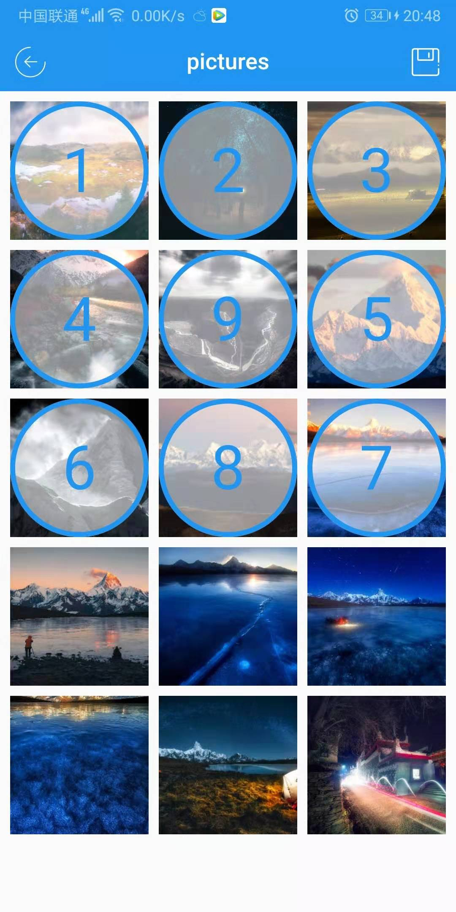
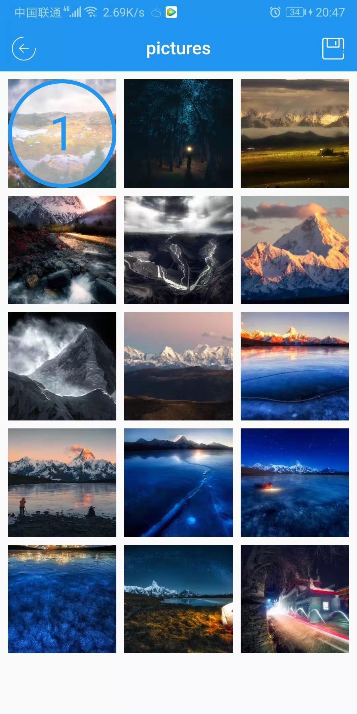

# image_picker_flutter

[](https://pub.dartlang.org/packages/image_picker_flutter)

A Flutter plugin for iOS and Android for picking images from the image library.

--|:--:|--
||
--|--
||

## Installation

First, add `image_picker_flutter` as a [dependency in your pubspec.yaml file]

``` aidl

dependencies:
  image_picker_flutter: ^1.3.2
  
```

### iOS

Add the following keys to your Info.plist:

``` IOS Keys

<key>NSPhotoLibraryUsageDescription</key>
<string>使用图片</string>
<key>NSCameraUsageDescription</key>
<string>照相</string>
<key>NSMicrophoneUsageDescription</key>
<string>录音</string>

```
### Android

Add the following permission to your manifest:

``` Android Permissions

<uses-permission android:name="android.permission.READ_EXTERNAL_STORAGE" />
<uses-permission android:name="android.permission.WRITE_EXTERNAL_STORAGE" />
<uses-permission android:name="android.permission.CAMERA" />

```
 

### Install app Android  

[apk download](https://fir.im/qfb8)


### API

```
 import 'package:flutter/material.dart';
 import 'package:flutter/widgets.dart';
 import 'package:image_picker_flutter/src/model/asset_data.dart';
 import 'package:image_picker_flutter/src/page/mul_image_picker_page.dart';
 import 'package:image_picker_flutter/src/page/single_image_picker_page.dart';
 import 'package:image_picker_flutter/src/utils.dart';
 
 typedef MulCallback = void Function(List<AssetData>);
 
 typedef SingleCallback = void Function(AssetData);
 
 typedef Callback = void Function(AssetData);
 
 class ImagePicker {
   ImagePicker._();
 
   static debug(bool isDebug) {
     Utils.isDebug = isDebug;
   }
 
   ///单选图片
   static void singlePicker(
     BuildContext context, {
     ImagePickerType type = ImagePickerType.imageAndVideo,
     Language language,
     ImageProvider placeholder,
     Widget title,
     Widget back,
     Decoration decoration,
     Color appBarColor = Colors.blue,
     SingleCallback singleCallback,
   }) {
     Navigator.of(context).push(
       MaterialPageRoute(
         builder: (context) => SingleImagePickerPage(
               type: type,
               language: language ?? Language(),
               placeholder: placeholder,
               decoration: decoration,
               appBarColor: appBarColor ?? Colors.blue,
               title: title,
               back: back,
             ),
       ),
     )..then((data) {
         if (data != null && singleCallback != null) {
           singleCallback(data);
         }
       });
   }
 
   ///多选图片
   static void mulPicker(
     BuildContext context, {
     List<AssetData> data,
     ImagePickerType type = ImagePickerType.imageAndVideo,
     int limit = 9,
     Language language,
     ImageProvider placeholder,
     Widget title,
     Widget back,
     Widget menu,
     Decoration decoration,
     Color appBarColor = Colors.blue,
     MulCallback mulCallback,
   }) {
     Navigator.of(context).push(
       MaterialPageRoute(
         builder: (context) => MulImagePickerPage(
               selectedData: data,
               type: type,
               limit: limit,
               appBarColor: appBarColor ?? Colors.blue,
               language: language ?? Language(),
               placeholder: placeholder,
               decoration: decoration,
               title: title,
               menu: menu,
               back: back,
             ),
       ),
     )..then((data) {
         if (data != null && mulCallback != null) {
           mulCallback(data);
         }
       });
   }
 
   ///拍照返回图片路径
   static void takePicture(Callback callback) {
     Utils.takePicture().then((a) {
       callback(a);
     });
   }
 
   ///录像返回图片路径
   static void takeVideo(Callback callback) {
     Utils.takeVideo().then((a) {
       callback(a);
     });
   }
 }
 
 enum ImagePickerType {
   onlyImage,
   onlyVideo,
   imageAndVideo,
 }
 
 ///文字基类
 class Language {
   String get title => "Gallery";
 
   String get showToast => "Only ### images can be selected";
 }
```
